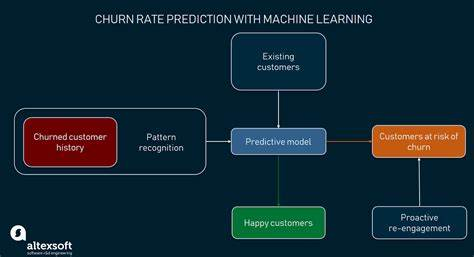
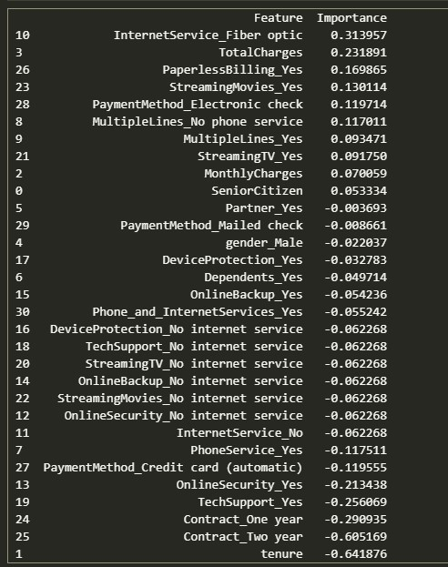
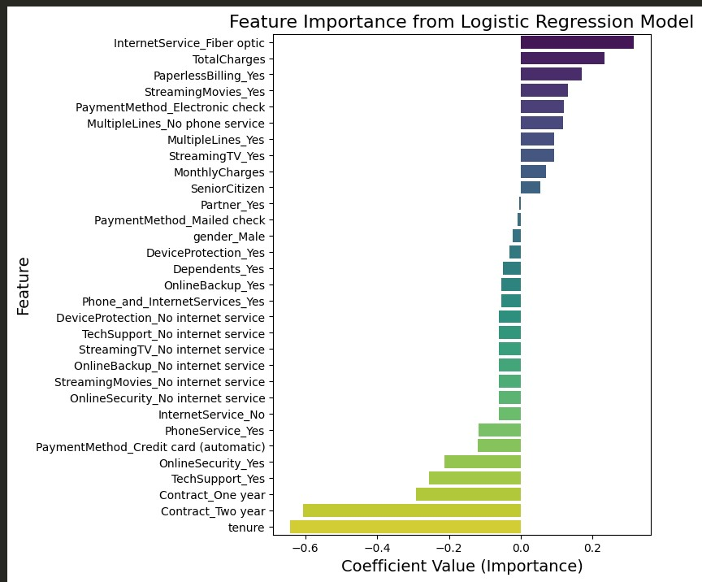
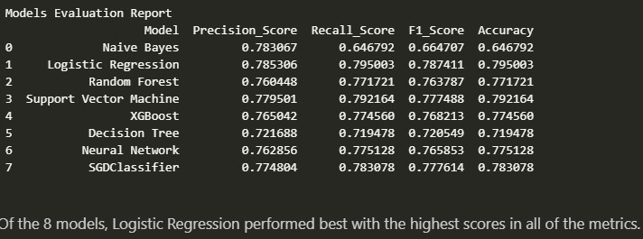
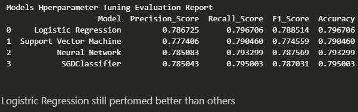
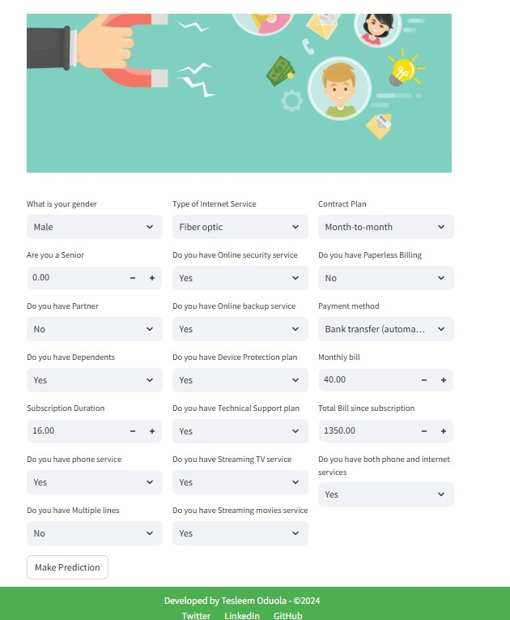

# Customer Churn Prediction

## Table of Contents
- [Project Overview](#project-overview)
- [Project Objective](#project-objective)
- [Data Source](#data-source)
- [Data Preprocessing](#data-prprocessing)
- [Model Building](#model-building)
- [Feature Importance](#feature-importance)
- [Model Evaluation](#model-evaluation)
- [Model Deployment](#model-deployment)
- [Conclusion](#Conclusion)

## Project Overview
Customer churn (also called customer attrition or customer turnover) is the percentage of customers that stopped 
using a company's product or service (for any reason) within a specified timeframe. This is one of the biggest 
expenditures for organizations. The purpose of this project was to develop an effective Machine Learning model 
to identify customers at risk of churning. By applying advanced analytics and machine learning techniques to the 
provided dataset, the goal is to offer actionable recommendations to the company, enabling them to implement targeted 
retention strategies. This will help reduce customer attrition, enhance customer loyalty, and maintain a competitive 
edge over in the industry.

## Project Objective
The goal is to accurately predict which customers are likely to churn (i.e., discontinue their services) by analyzing 
historical customer data. Also, to identify the key indicators of churn and recommend retention strategies.

## Data Source
The dataset for this project was sourced from Kaggle. It includes various features such as gender, SeniorCitizen status,
Partner, Dependents, tenure, PhoneService, MultipleLines, InternetService, OnlineSecurity, OnlineBackup, DeviceProtection, 
TechSupport, StreamingTV, StreamingMovies, Contract type, PaperlessBilling, PaymentMethod, MonthlyCharges, TotalCharges, 
and Churn. The target variable is Churn, where 1 represents churned, and 0 represents not churned

## Data Preprocessing
Data preprocessing was done to prepare the data for modelling
- **Handle missing values**: Ensured that all missing values in the dataset were properly addressed.
- **Remove duplicates**: Checked for duplicate values to avoid redundancy. No duplicates were found in the dataset.
- **Scale numerical variables**: Normalized numerical features to ensure consistent scaling.
- **Encode categorical variables**: Converted categorical features into numerical representations suitable for machine learning algorithms.

## Feature Engineering
- **Phone_and_internet**: A new feature created for customers who have both phone and internet services.
- **tenure_grouping**: Feature created by grouping customers based on their tenure, derived from the existing "tenure" column.

## Model Building
- SMOTE was applied to the training subset to handle class imbalance.
- Eight machine learning classifiers:
     - Logistic Regression
     - Support Vector Machine (Linear)
     - XGBoost, SGD, Random Forest
     - Decision Tree, Naïve Bayes
     - Neural Network—were imported
The classifiers were trained on the training dataset, and evaluated on the test subset of the dataset.

## Feature Importance
The following table lists the importance scores of various features used in the model. Higher positive values indicate greater importance 
in the model's predictions, while negative values suggest a lesser contribution or inverse relationship.

- **High Positive Scores**: Features like `InternetService_Fiber optic` and `TotalCharges` have high positive importance scores,
  meaning they significantly influence the model's predictions and are considered highly relevant.
- **Moderate Scores**: Features such as `StreamingMovies_Yes` and `PaymentMethod_Electronic check` have moderate positive importance,
  indicating they have a noticeable impact on the predictions but are less critical compared to the top features.
- **Low or Negative Scores**: Features like `tenure` and `Contract_Two year` show low or negative importance scores, suggesting they
   have minimal or even detrimental effects on the model’s predictions.

Overall, features related to internet service type and billing methods are among the most influential, while contract length and certain 
service-related features have less impact or a negative influence.

## Model Evaluation
The performance of the models was evaluated on the test dataset using metrics such as accuracy, precision, recall, and F1-score.
Below is a screenshot of the evaluation and hyperparameter tuning evaluation reports from the notebook:

Logistic Regression Model performed best and was chosen for deployment.

## Model Deployment
The tuned model was deployed using Streamlit. This allows for an interactive web application where users can input data and 
see predictions made by the model in real-time. 

